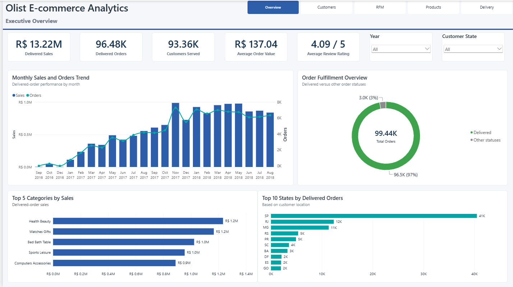
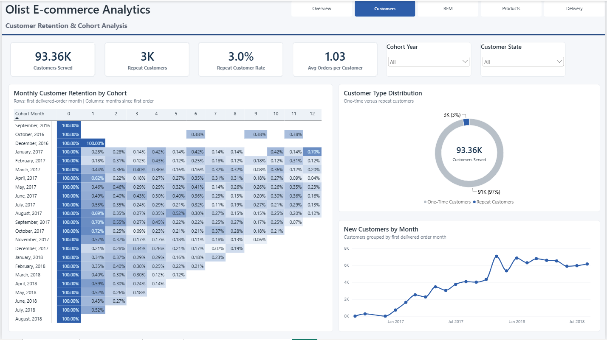
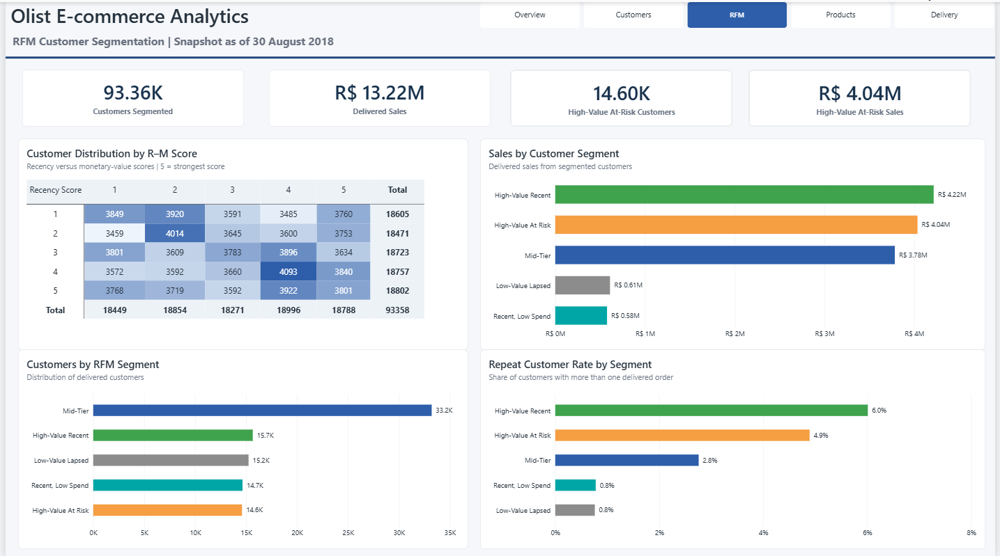
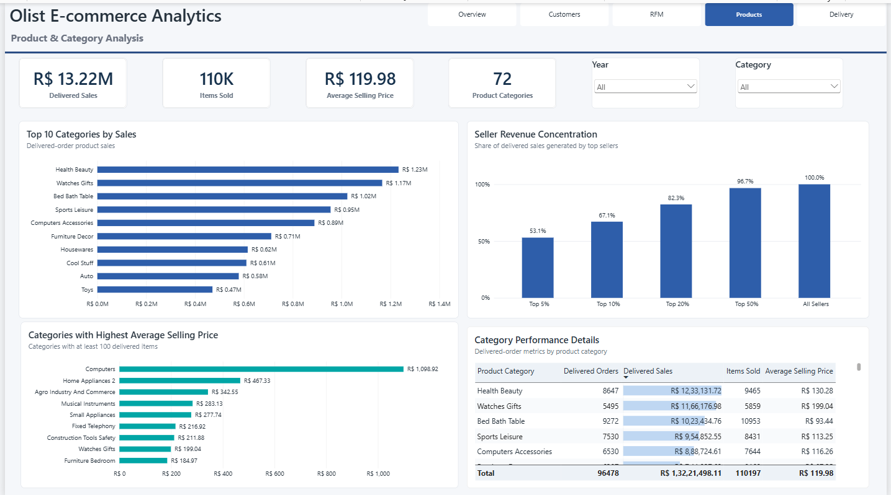
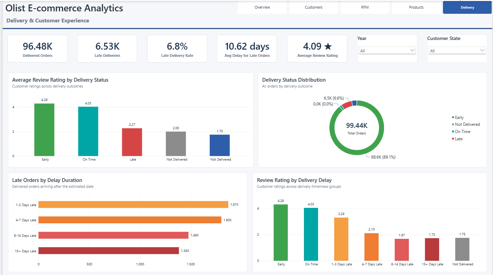

# Olist E-commerce Analytics

## Project Overview

This project analyzes the Brazilian Olist e-commerce dataset to evaluate sales performance, customer behaviour, product performance, retention, RFM segmentation, and delivery experience.

The project demonstrates an end-to-end analytics workflow using SQL Server, Power BI, Power Query, DAX, and Excel—from data validation and transformation through data modelling, dashboard development, and business insight generation.

## Business Objectives

* Evaluate delivered sales and order trends.
* Identify leading product categories and customer locations.
* Measure repeat purchasing and cohort retention.
* Segment customers using Recency, Frequency, and Monetary behaviour.
* Identify valuable customers at risk of becoming inactive.
* Measure seller-revenue concentration.
* Analyze late deliveries and their relationship with review ratings.

## Dashboard Preview

### 1. Executive Overview



Summarizes delivered sales, orders, customers, average order value, review ratings, monthly performance, order fulfilment, leading categories, and customer geography.

### 2. Customer Retention & Cohort Analysis



Examines customer acquisition, one-time versus repeat customers, and monthly retention following each customer’s first delivered order.

### 3. RFM Customer Segmentation



Compares customer distribution, delivered sales, and repeat-customer rates across actionable customer segments.

> RFM segmentation represents a fixed snapshot as of **30 August 2018**.

### 4. Product & Category Analysis



Evaluates category sales, items sold, average selling price, seller-revenue concentration, and detailed category performance.

> The **72 Product Categories** KPI represents the full translated product catalogue and is intentionally unaffected by the Year slicer.

### 5. Delivery & Customer Experience



Analyzes delivery outcomes, late-delivery duration, and the relationship between delivery timeliness and customer ratings.

## Key Insights

* Olist generated approximately **R$13.22M in delivered sales** from **96.48K delivered orders**, with an average order value of **R$137.04**.
* Approximately **97% of all orders were delivered**.
* Health & Beauty generated approximately **R$1.23M**, making it the leading category while contributing only about **9% of delivered sales**—evidence of a diversified product mix.
* Only approximately **3% of delivered-order customers made repeat purchases**, highlighting a substantial retention opportunity.
* Cohort retention fell sharply after the first delivered order, with most subsequent monthly retention values below 1%.
* The **top 5% of sellers generated 53.1%** of delivered sales, while the top 20% generated 82.3%.
* Approximately **14.60K High-Value At-Risk customers** represented around **R$4.04M in delivered sales**, making them an important re-engagement group.
* Approximately **6.53K delivered orders arrived late**, producing a late-delivery rate of approximately **6.8%**.
* Average review ratings declined from **4.29 for early deliveries** to **2.27 for late deliveries**, demonstrating the effect of delivery performance on customer satisfaction.

## Recommendations

* Develop targeted campaigns to convert first-time customers into repeat purchasers.
* Prioritize re-engagement of High-Value At-Risk customers.
* Investigate the operational causes of delivery delays, particularly delays exceeding seven days.
* Monitor high-contributing sellers while reducing excessive dependence on a small seller group.
* Continue investing in leading categories while maintaining the existing diversified product mix.

## Methodology

* Cleaned and validated source tables using SQL Server and Power Query.
* Built a relational Power BI model connecting customers, orders, products, sellers, payments, reviews, and dates.
* Used delivered orders for realized sales, customer, product, cohort, and RFM metrics.
* Created reusable DAX measures for sales, order value, retention, segmentation, seller concentration, and delivery performance.
* Cross-validated important KPIs and data-quality findings between SQL and Power BI.

For detailed preparation steps, relationships, metric definitions, and assumptions, see the [Methodology Documentation](Documentation/Methodology.md).

## Tools and Skills

* **SQL Server:** Data exploration, cleaning, validation, joins, CTEs, aggregations, window functions, and analytical queries
* **Power BI:** Data modelling, DAX, interactive reporting, slicers, tooltips, conditional formatting, and navigation
* **Power Query:** Data-type correction, deduplication, translation merges, and business-friendly transformations
* **Excel:** KPI validation, monthly trend reconciliation, and pivot-table analysis
* **Analytical methods:** Cohort analysis, retention analysis, RFM segmentation, seller concentration, and delivery-performance analysis

## Repository Structure

```text
olist-ecommerce-data-analysis/
├── README.md
├── Power BI/
│   └── Olist_Ecommerce_Analytics_Portfolio.pbix
├── SQL/
│   └── SQL analysis files
├── Excel/
│   └── Excel validation file
├── Screenshots/
│   ├── 01_Executive_Overview.png
│   ├── 02_Customer_Analysis.png
│   ├── 03_RFM_Segmentation.png
│   ├── 04_Product_Analysis.png
│   └── 05_Delivery_Experience.png
└── Documentation/
    └── Methodology.md
```

## Important Notes

- Commercial metrics such as delivered sales, average order value, product performance, retention, and RFM segmentation use **delivered orders only**.
- **“Delivered Sales” is used instead of “Revenue.”** It represents the sum of item prices associated with delivered orders and excludes freight. The dataset does not provide Olist’s commissions, seller fees, costs, or recognized accounting revenue.
- Fulfilment visuals retain all order statuses where required.
- Currency values are presented in Brazilian Real (`R$`).
- RFM analysis uses **30 August 2018** as its fixed reference date.
- The Product Categories KPI represents the full translated catalogue and does not change with the Year slicer.

## Data Source

[Brazilian E-Commerce Public Dataset by Olist](https://www.kaggle.com/datasets/olistbr/brazilian-ecommerce) — Kaggle

The dataset contains anonymized information about marketplace orders, customers, products, sellers, payments, reviews, and delivery activity.
